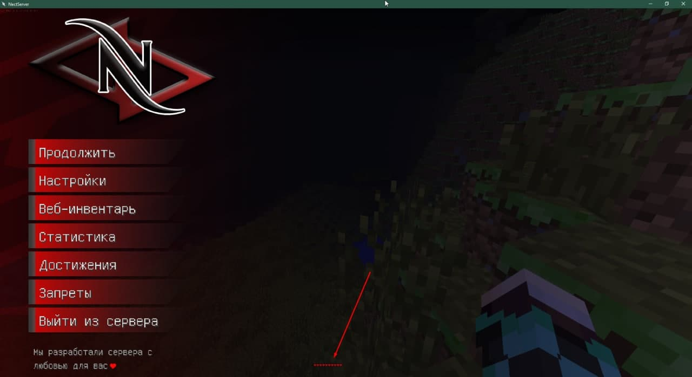

# THELIVAN COMMERCIAL
Всем привет, меня зовут Марк и я java-разработчик. Предоставляю услуги в сфере майнкрафт-моддинга.  
ВК - [***тык***](https://vk.com/badcodemylife)  
Сайт -  [***тык***](https://thelivan.ru)
# Услуги

1. __Разработка модификаций FORGE любой сложности на версии 1.12.2, 1.7.10.__
2. __Исправление багов/дюпов/крашей/ недочётов модификаций.__
3. __Продажа готовых(самописных) модификаций для серверов.__
4. Разработка DISCORD ботов (Java) с поддержкой/расширением.
5. Настройка/установка серверов 1.7.10, 1.12.2, настройка/установка плагинов.
6. Установка/настройка/поддержка работоспособности GravitLauncher.

>__ПРЕДОСТАВЛЯЮ ПОЛНУЮ ЗАЩИТУ: РАЗДЕЛЕНИЕ КЛИЕНТ-СЕРВЕР, ОБФУСКАЦИЯ__
__РАБОТАЮ ПО ОФОРМЛЕННОМУ, ЧЕТКОМУ ТЗ. СРОКИ И ЦЕНУ БЕЗ ТЗ НЕ ОЦЕНИВАЮ. РАБОТАЮ НЕ БЫСТРО.__

Оплату принимаю на _сбербанк_, _тинькофф_. 

# Мои работы
1. __[ГУИ/CЕРВЕР]__ CubaCabinet, личный кабинет в игре, реализовано: покупка привелегии, кейсы, магазин предметов, покупка китов.  

2. __[ГУИ/КЛИЕНТ]__ NectMenu, изменённые дефолтные гуи майнкрафта.

3. __[АДДОН/СЕРВЕР]__ SpaceTechnologies, мод-аддон для HiTech сервера. Реализовано: панельки, энергохранилища, автоспавнер, генераторы материи (1-10 ур), генераторы нейтрония.  

4. __[ГУИ/CЕРВЕР]__ NectTrade(1.7.10/1.12.2), мод на обмены между игроками, имеет чат, есть поддержка iConomy.  

6. __[МОД/CЕРВЕР]__ (1.7.10) AuroraShop, мод на витрины продажи предметов, имеет поддержку iConomy.  

# Мои проекты

1. [Eternal Darkness](https://vk.com/eternaldarknessmc)  
2. [NectHub](https://necthub.ru/)  
3. [RPMine](https://vk.com/rpmineserver)  
