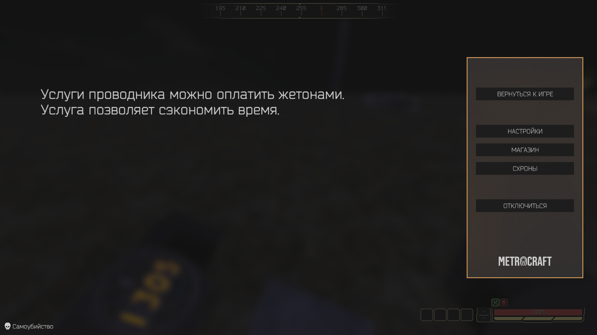
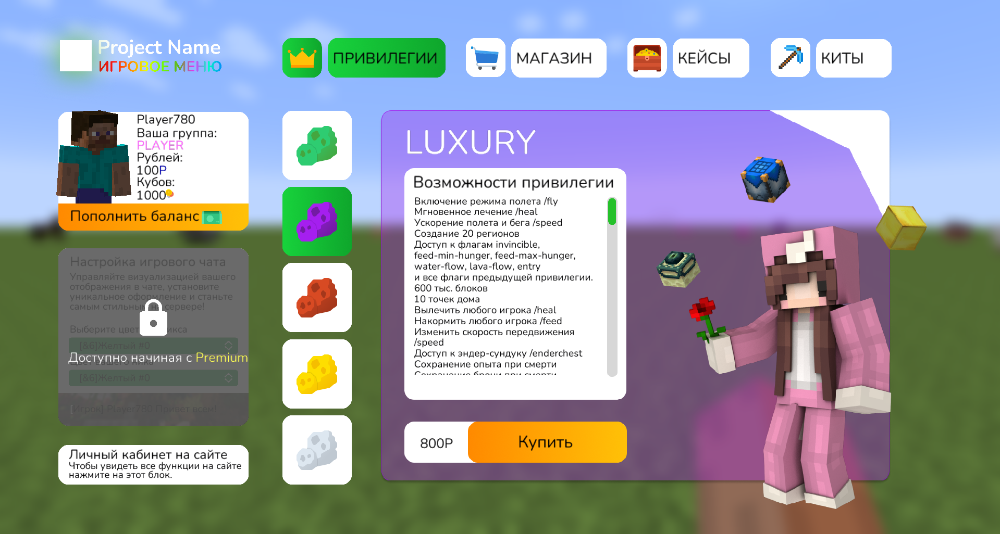
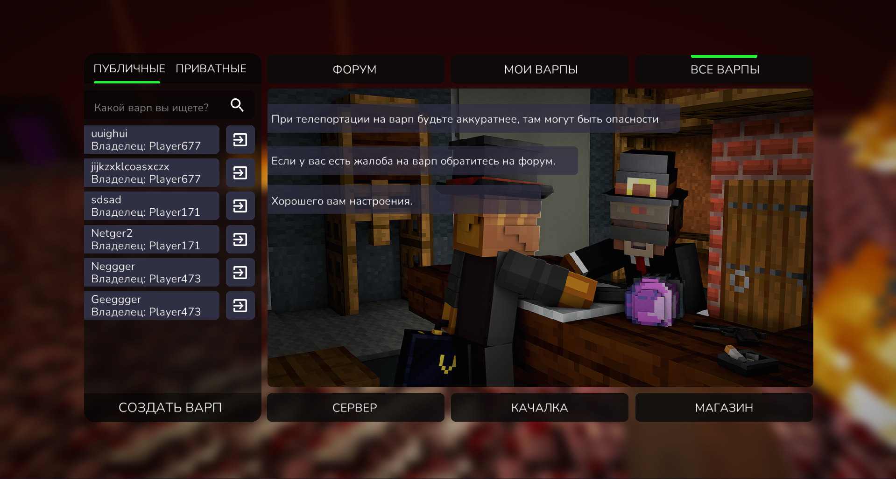
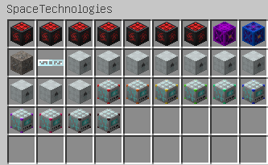

# THELIVAN COMMERCIAL
Меня зовут Марк и я Java-разработчик. Предоставляю услуги в сфере майнкрафт-моддинга.
Берусь за сложные, интересные заказы, так и за фиксы. Верстаю гуи.  
ВК - [***тык***](https://vk.com/thelivan)  
Telegram -  [***тык***](https://t.me/thelivan)  
Сайт -  [***тык***](https://thelivan.ru)

# НЕ ПРИНИМАЮ ЗАКАЗЫ, РАССМАТРИВАЮ ВАРИАНТЫ СОТРУДНИЧЕСТВА В КАЧЕСТВЕ TECH LEAD

# УСЛУГИ
1. __Разработка модификаций FORGE любой сложности на версии 1.12.2, 1.7.10.__
2. __Исправление багов/дюпов/крашей/ недочётов модификаций.__
3. __Продажа готовых(самописных) модификаций для серверов.__
4. __Предоставляю защиту ресурсов игры от воровства (PNG, OBJ)__
5. Разработка DISCORD ботов (Java) с поддержкой/расширением.

>__ПРЕДОСТАВЛЯЮ ПОЛНУЮ ЗАЩИТУ: РАЗДЕЛЕНИЕ КЛИЕНТ-СЕРВЕР, ОБФУСКАЦИЯ__  
__РАБОТАЮ ПО ОФОРМЛЕННОМУ, ЧЕТКОМУ ТЗ. СРОКИ И ЦЕНУ БЕЗ ТЗ НЕ ОЦЕНИВАЮ.  РАБОТАЮ НЕ БЫСТРО.__

Оплату принимаю на _сбербанк_, _тинькофф_, _СБП_. 
__Принимаю оплату через Binance.__

# УСЛОВИЯ
1. __Предоплата 30-50% цены заказа.__   1.1. Предоплата всегда возвращается в случае проблем с выполнением заказа.    1.2. В случае отказа от заказа исполнитель имеет право вычесть из предоплаты неустойку в размере 20-40% от суммы заказа, в зависимости от потраченного времени.
2. [__Это я и это важно знать(очень важно)__ ](https://antislang.ru/wp-content/uploads/%D0%B4%D0%B5%D0%B4%D0%BB%D0%B0%D0%B9%D0%BD-1.jpg)
3. В случае объемной разработки, ВАЖНО иметь при себе КАЧЕСТВЕННО оформленное техническое задание.
4. Дизайн предоставляется заказчиком.
# ПРИМЕРЫ РАБОТ
1. __[МОД/CЕРВЕР]__ TLCleaner. Мод заменяюзщий плагин на очистку, имеет больший функционал, и более удобен. 
2. __[CЕРВЕР/КЛИЕНТ]__ Metrocraft 2036. Разработка проекта, тех лидерство.

3. __[МОД/CЕРВЕР]__ Меню кастомизации персонажа 
4. __[МОД/CЕРВЕР]__ Кастомный инвентарь игрока c системой сумок, и аттибутов игрока 
5. __[ГУИ/CЕРВЕР]__ CubaCabinet, личный кабинет в игре, реализовано: покупка привелегий, магазин предметов, кейсы, покупка китов.  

6. __[ГУИ/КЛИЕНТ]__ NectMenu, изменённые дефолтные гуи майнкрафта

7. __[МОД/CЕРВЕР]__ Ae2Adddon, аддон для appliedenergistics2 и связка его с botania. Система автокрафтов 5x5, 7x7, 9x9

8. __[ГУИ/КЛИЕНТ]__ AurMineWarp, удобная система варпов

9. __[АДДОН/СЕРВЕР]__ SpaceTechnologies, мод-аддон для HiTech сервера. Реализовано: панельки, энергохранилища, автоспавнер, генераторы материи (1-10 ур), генераторы нейтрония  

10. __[ГУИ/CЕРВЕР]__ NectTrade, мод на обмены между игроками, имеет внутренний чат, есть поддержка iConomy  

11. __[МОД/CЕРВЕР]__ Wiki Aratorn RPG, внутриигровое вики меню  

12. __[ГУИ/CЕРВЕР]__ SpaceUniverseCase система кейсов с анимацией прокрутки  

10. __[МОД/CЕРВЕР]__ AuroraShop, мод на витрины продажи предметов, имеет поддержку iConomy  

