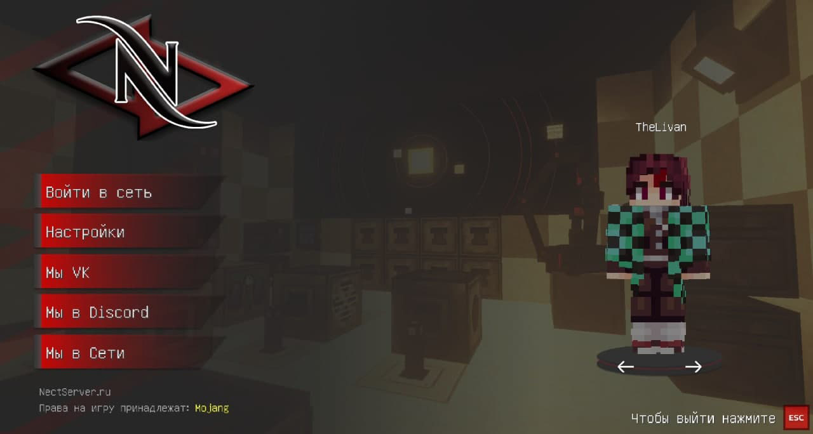

# THELIVAN COMMERCIAL
Меня зовут Марк и я java разработчик. Предоставляю услуги в сфере майнкрафт-моддинга.
Берусь за сложные, интересные заказы, так и за фиксы. Верстаю гуи.  
ВК - [***тык***](https://vk.com/badcodemylife)  
Telegram -  [***тык***](https://t.me/thelivan)  
Сайт -  [***тык***](https://thelivan.ru)

# Услуги
1. __Разработка модификаций FORGE любой сложности на версии 1.12.2, 1.7.10.__
2. __Исправление багов/дюпов/крашей/ недочётов модификаций.__
3. __Продажа готовых(самописных) модификаций для серверов.__
4. __Предоставляю защиту ресурсов игры от воровства (PNG, OBJ)__
5. Разработка DISCORD ботов (Java) с поддержкой/расширением.

>__ПРЕДОСТАВЛЯЮ ПОЛНУЮ ЗАЩИТУ: РАЗДЕЛЕНИЕ КЛИЕНТ-СЕРВЕР, ОБФУСКАЦИЯ__  
__РАБОТАЮ ПО ОФОРМЛЕННОМУ, ЧЕТКОМУ ТЗ. СРОКИ И ЦЕНУ БЕЗ ТЗ НЕ ОЦЕНИВАЮ.  РАБОТАЮ НЕ БЫСТРО.__

Оплату принимаю на _сбербанк_, _тинькофф_. 

# Мои работы
1. __[МОД/CЕРВЕР]__ (1.7.10) TLCleaner. Мод заменяюзщий плагин на очистку, имеет больший функционал, и более удобен.
2. __[МОД/CЕРВЕР]__ (1.7.10) Кастомизация скина персонажа. 
3. __[ГУИ/CЕРВЕР]__ (1.7.10) CubaCabinet, личный кабинет в игре, реализовано: покупка привелегий, магазин предметов, кейсы, покупка китов.  

4. __[ГУИ/КЛИЕНТ]__ (1.7.10) NectMenu, изменённые дефолтные гуи майнкрафта.

5. __[ГУИ/КЛИЕНТ]__ (1.7.10) AurMineWarp, удобная система варпов.

6. __[АДДОН/СЕРВЕР]__ (1.7.10) SpaceTechnologies, мод-аддон для HiTech сервера. Реализовано: панельки, энергохранилища, автоспавнер, генераторы материи (1-10 ур), генераторы нейтрония.  

7. __[ГУИ/CЕРВЕР]__ (1.7.10/1.12.2) NectTrade, мод на обмены между игроками, имеет чат, есть поддержка iConomy.  

8. __[МОД/CЕРВЕР]__ (1.7.10) AuroraShop, мод на витрины продажи предметов, имеет поддержку iConomy.  

9. __[ГУИ/CЕРВЕР]__ (1.7.10) SpaceUniverseCase.  

10. __[МОД/CЕРВЕР]__ (1.7.10) OrintaleVending.  

# Мои проекты

1. [Eternal Darkness](https://vk.com/eternaldarknessmc)
2. [RPMine](https://vk.com/rpmineserver)
3. [Arda](https://vk.com/ardalotr)
4. [GrandGear](https://grandgear.top/)
5. [FrostLand](https://frostland.pro/)
